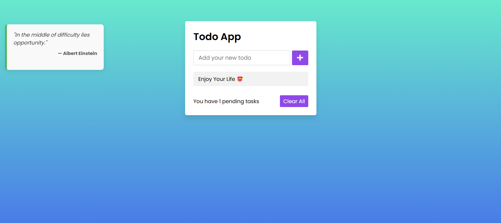

# 🚀 Zentra — Task Mastery Redefined

**Zentra isn’t just another To-Do app — it’s your minimalist partner in mastering daily focus, clarity, and execution.**  
Whether you’re a productivity geek or just want a better way to manage your day, Zentra brings elegance and purpose to your task flow.

### 🎯 Less clutter. More action. Total control.

- **Minimalist & distraction-free design** that keeps your mind clear and your goals in sight
- **Flawless user experience** built to help you stay in the zone and execute with precision
- **Intelligent task management** that keeps everything organized — without the overwhelm

---

## 🌐 Live Demo

✨ Experience the app in real-time and enjoy its clean, smart design:

[🔗Live Demo](https://zentra-app.netlify.app)

---

## 🚀 Technologies Used

  
  
  
  

---

## ⚙️ Features

- **Add, update, and remove tasks** seamlessly with smooth animations.
- **Persistent storage** using `localStorage` to keep your tasks safe across sessions.
- **Task completion status** to mark tasks done and track your progress.
- **Clear all tasks** functionality with confirmation prompts for safety.
- **Error handling and validation** to make sure your input is always valid.
- **Responsive UI** that adapts perfectly to any screen size.

---

## 💡 Why Zentra Stands Out?

🧘‍♂️ Minimalist Design — A distraction-free interface for ultimate focus

⚡ Instant Task Management — Add, complete, or delete tasks with ease

🧮 Live Task Counter — Always know how many tasks are left

🧹 One-Click Clear — Remove all tasks instantly (with confirmation)

📱 Fully Responsive — Seamless experience on desktop, tablet, or mobile

---

## 💬 Why Zentra?

Because true productivity isn’t about doing more — it’s about doing what matters with clarity.  
Zentra helps you stay focused, organized, and fully in control of your time — no distractions, no clutter.

---

## 🤝 Contribution & Contact

Feedback, suggestions, and contributions are always welcome.  
Feel free to reach out if you’re interested in collaborating or have any questions.

---

## 👤 About the Developer

Crafted with passion by **[Ayoub Akbartabar](ayoubakbartabar1887@gmail.com)** – a developer who believes digital experiences should feel magical.  
If this project sparks your interest or you have any questions, feel free to reach out! ✉️

  
  
  

